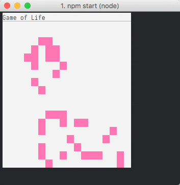

# Game of Life but no ifs

<p align="center">
	
	<br>
</p>

Cell lifecycle logic without conditions and hash maps, just math and bitwise operators:

```js
Math.floor(((numberOfActiveAdjacentCells | currentState) ^ 12) / 15);
```
